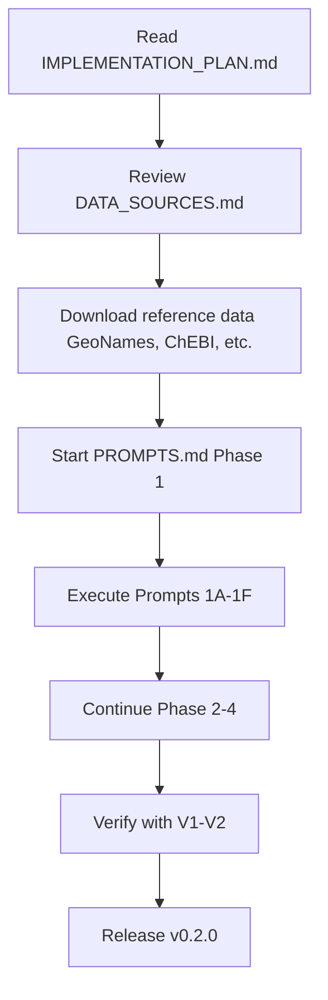

# EntityIdentity v0.2.0 - Planning Documents Index

**Current Version**: v0.1.0 (Companies, Countries, Metals)
**Target Version**: v0.2.0 (+ Baskets, Periods, Places, Units, Instruments, Facilities)
**Status**: Planning Complete, Ready for Implementation

---

## Quick Start

**If you're implementing v0.2.0, start here**:

1. Read **IMPLEMENTATION_PLAN.md** (complete specification)
2. Use **PROMPTS.md** (step-by-step execution guide for Claude Code)
3. Reference **DATA_SOURCES.md** (ground truth sources for each entity)

---

## Planning Documents Overview

### Core Planning

| Document | Purpose | Size | Audience |
|----------|---------|------|----------|
| **[IMPLEMENTATION_PLAN.md](IMPLEMENTATION_PLAN.md)** | Complete v0.2.0 specification | ~2000 lines | Developers, AI assistants |
| **[PROMPTS.md](PROMPTS.md)** | Step-by-step implementation prompts | ~600 lines | Claude Code sessions |
| **[DATA_SOURCES.md](DATA_SOURCES.md)** | Authoritative source reference | ~400 lines | Data engineers, compliance |

### Summary Documents

| Document | Purpose | Size | Audience |
|----------|---------|------|----------|
| **[UPDATES_SUMMARY.md](UPDATES_SUMMARY.md)** | Places module addition summary | ~400 lines | Project managers |
| **[DATA_SOURCES_INTEGRATION_SUMMARY.md](DATA_SOURCES_INTEGRATION_SUMMARY.md)** | Data sources integration | ~300 lines | Technical leads |
| **[PLANNING_INDEX.md](PLANNING_INDEX.md)** | This file - navigation guide | ~200 lines | Everyone |

### Project Documentation (Existing)

| Document | Purpose | Updated? |
|----------|---------|----------|
| **[README.md](README.md)** | Public-facing package documentation | ✅ Yes (integrated functional analysis) |
| **[CLAUDE.md](CLAUDE.md)** | Developer/architecture guide | 🔜 After implementation |
| **[MAINTENANCE.md](MAINTENANCE.md)** | Maintenance procedures | 🔜 After implementation |

---

## Document Purposes & When to Use

### IMPLEMENTATION_PLAN.md

**Use when**:
- Planning implementation strategy
- Understanding complete system architecture
- Writing code for new modules
- Resolving design questions

**Contains**:
- Executive summary (6 new entity types)
- Complete API specifications for all modules
- Resolution algorithms (blocking → scoring → decision)
- Data source hierarchies with URLs and licenses
- Testing strategy (120+ new tests)
- Integration patterns and workflows
- 6-week implementation roadmap
- Success criteria and benchmarks

**Structure**:
```
A. Repository Structure
B. Public APIs (7 entity types)
C. Implementation Patterns
D. Testing Strategy
E. Authoritative Data Sources ← NEW
F. Data Contracts
G. Resolution Precedence
H. Implementation Roadmap
I. Success Criteria
J. Dependencies & Requirements ← UPDATED
K. Open Questions
L. Migration Guide
M. Example Workflows
```

---

### PROMPTS.md

**Use when**:
- Actually implementing the code
- Running Claude Code sessions
- Following step-by-step execution
- Verifying implementation success

**Contains**:
- 20+ self-contained prompts for Claude Code
- Organized by phase (Foundation, Conversion, Integration)
- Success criteria for each prompt
- Checkpoint verification commands
- Troubleshooting guidance

**Workflow**:
```
Phase 1: Foundation (Prompts 1A-1F)
  1A. Baskets - Implementation
  1B. Baskets - Tests
  1C. Period - Implementation
  1D. Period - Tests
  1E. Places - Implementation ← NEW
  1F. Places - Tests ← NEW

Phase 2: Conversion & Ground Truth (Prompts 2A-2E)
  2A. Units - Implementation
  2B. Units - Tests
  2C. Instruments - Data Loading
  2D. Instruments - Resolution
  2E. Instruments - Tests

Phase 3: Facilities (Prompts 3A-3B)
  3A. Facilities - Stub Implementation
  3B. Facilities - Tests (skip pattern)

Phase 4: Integration (Prompts 4A-4F)
  4A. Package Integration
  4B. Update Main README
  4C. Update CLAUDE.md
  4D. Integration Tests
  4E. Performance Benchmarks
  4F. Final Documentation

Verification (Prompts V1-V2)
  V1. Smoke Test
  V2. Coverage Report
```

---

### DATA_SOURCES.md

**Use when**:
- Finding authoritative data sources
- Understanding license requirements
- Setting up data download pipelines
- Verifying data provenance

**Contains**:
- Source priority tables for all 7 entity types
- Complete URLs and download instructions
- License compliance requirements (CC-BY 4.0, ODbL, public domain)
- Update cadences (daily, monthly, annual)
- Attribution requirements with examples
- Builder script references

**Quick Reference Sections**:
```
1. Metals: IUPAC → ChEBI/PubChem → USGS
2. Places: GeoNames → OSM → Nominatim
3. Baskets: Issuer RNS → WPIC → Facility overrides
4. Units: SI/BIPM → UCUM → Market basis
5. Instruments: Internal parquet → LME → CME → Fastmarkets
6. Facilities: USGS datasets → MRDS/USMIN → Curated → Mindat
7. Periods: ISO 8601 → CLDR

License Compliance
Update Cadences
Builder Scripts
Download URLs
```

---

### UPDATES_SUMMARY.md

**Use when**:
- Understanding what changed from initial plan
- Explaining the places module addition
- Reviewing decision rationale

**Contains**:
- Change summary (5 → 6 entities)
- Rationale for adding places module
- Technical implementation details
- Integration with facilities module
- Updated roadmap and metrics

---

### DATA_SOURCES_INTEGRATION_SUMMARY.md

**Use when**:
- Understanding data provenance improvements
- Reviewing license compliance additions
- Tracking documentation scope

**Contains**:
- Summary of IMPLEMENTATION_PLAN.md Section E addition
- New dependencies and environment variables
- License compliance files and templates
- Implementation impact metrics
- Next steps for data acquisition

---

## Implementation Workflow

### Recommended Path



### Estimated Timeline

| Phase | Duration | Prompts | Deliverable |
|-------|----------|---------|-------------|
| Phase 0: Data Acquisition | 1 day | N/A | GeoNames, ChEBI, USGS data |
| Phase 1: Foundation | 2 weeks | 1A-1F | Baskets, Period, Places modules |
| Phase 2: Conversion | 2 weeks | 2A-2E | Units, Instruments modules |
| Phase 3: Facilities | 1 week | 3A-3B | Facilities stub |
| Phase 4: Integration | 1 week | 4A-4F | Final integration, docs, tests |
| **Total** | **6 weeks** | **20 prompts** | **EntityIdentity v0.2.0** |

---

## Success Metrics

### Functional
- ✅ 6 new entity modules (Baskets, Periods, Places, Units, Instruments, Facilities)
- ✅ 120+ new tests (coverage ≥85%)
- ✅ All APIs mirror existing patterns
- ✅ Blocking/scoring achieves 99%+ reduction

### Data Quality
- ✅ All modules backed by authoritative sources
- ✅ Source priority hierarchies implemented
- ✅ License compliance (CC-BY 4.0, ODbL, public domain)
- ✅ Attribution in code and output files

### Performance
- ✅ Query latency <100ms (warm cache)
- ✅ Memory footprint <500MB total
- ✅ First load <1s for all data tables

### Documentation
- ✅ Complete API reference
- ✅ Data source provenance documented
- ✅ Migration guide (v0.1 → v0.2)
- ✅ Integration patterns and examples

---

## Key Decisions Documented

### 1. Places Module Addition (UPDATES_SUMMARY.md)
**Decision**: Add places/ module for admin1 resolution
**Rationale**: Facilities module requires place_hint with admin1 data
**Impact**: 5 → 6 modules, +15 tests, +1 prompt

### 2. Data Source Hierarchies (DATA_SOURCES.md)
**Decision**: Document authoritative sources for all entities
**Rationale**: Mirror Companies pattern (GLEIF → Wikidata → Exchanges)
**Impact**: 30+ sources documented, license compliance, update procedures

### 3. GeoNames as Places Source (IMPLEMENTATION_PLAN.md Section E.2)
**Decision**: GeoNames (Priority 1) → OSM (Priority 2) → Nominatim (Priority 3)
**Rationale**: Global coverage, CC-BY 4.0, daily updates, 12M places
**Alternative**: Natural Earth (less coverage, simpler license)

### 4. ISO 8601 for Periods (IMPLEMENTATION_PLAN.md Section E.7)
**Decision**: Use ISO 8601 week-date format (Monday start)
**Rationale**: International standard, avoids US/ISO week confusion
**Note**: Week 1 = first week containing Thursday

### 5. Facilities as Stub (IMPLEMENTATION_PLAN.md Section H)
**Decision**: Implement stub with company fallback
**Rationale**: USGS data requires curation, can implement full later
**Pattern**: Skip tests when data unavailable

---

## Common Questions

### Q: Which document do I read first?
**A**: Start with **IMPLEMENTATION_PLAN.md** for complete context, then **PROMPTS.md** for execution.

### Q: How do I know which data sources to use?
**A**: See **DATA_SOURCES.md** source priority tables. Always use Priority 1 first.

### Q: Can I skip the places module?
**A**: Not recommended. Facilities module depends on it. If you skip, facilities will only have company fallback.

### Q: What if I can't access GCS for instruments?
**A**: Set `GSMC_TICKERS_PATH` env var to local path. See IMPLEMENTATION_PLAN.md Section J.

### Q: How do I handle license compliance?
**A**: See **DATA_SOURCES.md** license section and **IMPLEMENTATION_PLAN.md** Section J for attribution examples.

### Q: Can I implement modules in different order?
**A**: **Baskets, Period, Places** are independent and can be parallelized. **Units** and **Instruments** can be parallel. **Facilities** depends on **Places**. Follow PROMPTS.md for recommended order.

---

## File Cross-References

### Where to Find Specific Information

| Information | Primary Source | Also See |
|------------|----------------|----------|
| API signatures | IMPLEMENTATION_PLAN.md Section B | README.md |
| Resolution algorithms | IMPLEMENTATION_PLAN.md Section C | CLAUDE.md (v0.2) |
| Testing strategy | IMPLEMENTATION_PLAN.md Section D | PROMPTS.md |
| Data sources | DATA_SOURCES.md | IMPLEMENTATION_PLAN.md Section E |
| License compliance | DATA_SOURCES.md | IMPLEMENTATION_PLAN.md Section J |
| Implementation prompts | PROMPTS.md | - |
| Roadmap | IMPLEMENTATION_PLAN.md Section H | UPDATES_SUMMARY.md |
| Success criteria | IMPLEMENTATION_PLAN.md Section I | - |
| Dependencies | IMPLEMENTATION_PLAN.md Section J | requirements.txt |
| Example workflows | IMPLEMENTATION_PLAN.md Section M | README.md |
| Changes from v0.1 | UPDATES_SUMMARY.md | IMPLEMENTATION_PLAN.md Section L |

---

## Version History

| Version | Date | Changes |
|---------|------|---------|
| v0.1.0 | 2025-10-01 | Initial planning (5 modules) |
| v0.1.1 | 2025-10-02 | Added places module (6 modules) |
| v0.1.2 | 2025-10-02 | Integrated data sources (30+ sources) |
| v0.1.3 | 2025-10-02 | Enhanced dependencies, license compliance |
| **Current** | **2025-10-02** | **Planning complete, ready for implementation** |

---

## Next Actions

### For Project Manager
1. ✅ Review IMPLEMENTATION_PLAN.md (complete specification)
2. ✅ Approve 6-week timeline (IMPLEMENTATION_PLAN.md Section H)
3. ✅ Verify license compliance requirements (DATA_SOURCES.md)

### For Developer / AI Assistant
1. ✅ Read IMPLEMENTATION_PLAN.md in full
2. ✅ Set up development environment (IMPLEMENTATION_PLAN.md Section J)
3. ✅ Download reference data (DATA_SOURCES.md quick reference)
4. 🔜 Start Phase 1: Execute Prompt 1A (PROMPTS.md)

### For Data Engineer
1. ✅ Review DATA_SOURCES.md source priority tables
2. ✅ Download GeoNames, ChEBI, USGS data
3. ✅ Set up attribution files (LICENSE_*.txt templates in IMPLEMENTATION_PLAN.md)
4. 🔜 Assist with builder scripts (Section E examples)

---

## Support & Feedback

**Questions about**:
- **Architecture**: See IMPLEMENTATION_PLAN.md or CLAUDE.md
- **Data sources**: See DATA_SOURCES.md
- **Implementation**: See PROMPTS.md
- **Changes**: See UPDATES_SUMMARY.md

**Issues**:
- Report on GitHub: https://github.com/microprediction/entityidentity/issues
- Tag with `v0.2.0` label

---

**End of Planning Index**

**Status**: ✅ All planning documents complete and aligned
**Ready for**: Implementation (follow PROMPTS.md)
**Target**: EntityIdentity v0.2.0 release in 6 weeks
